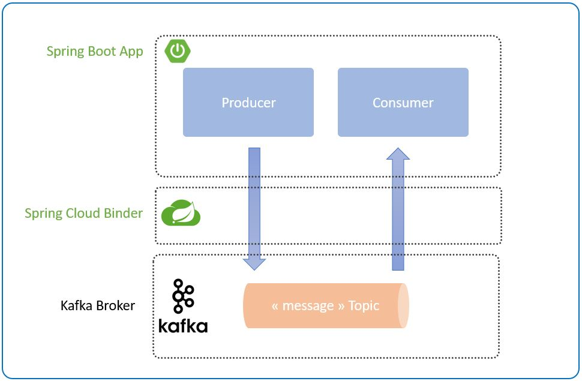
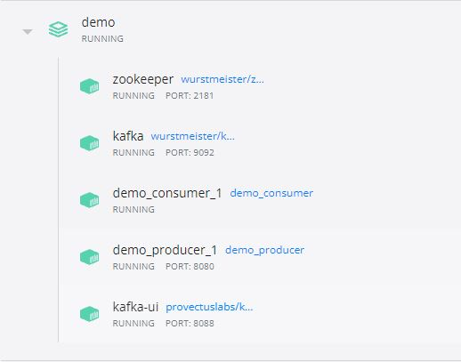
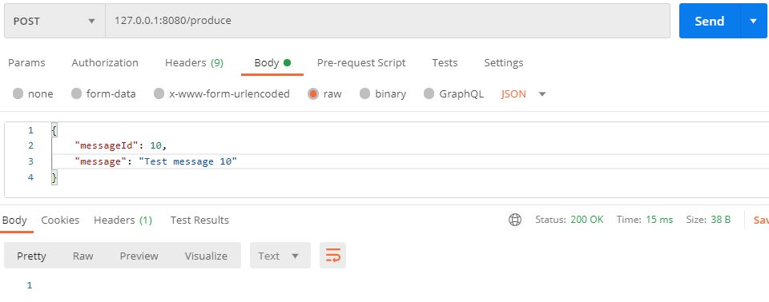
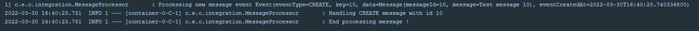
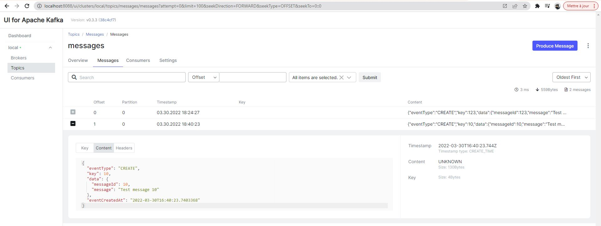

## Event Driven Architecture using Spring Cloud and Kafka broker

Hello everyone, in this tutorial we will implement an event driven architecture using spring boot, spring cloud and kafka broker. Enjoy !
The goal of this tutorial is to implement the event driven architecture using one producer and one consumer with a single topic.



## Prerequisites
- Java 8 or greater (I'm using java 17 for this tutorial)
- Maven 2 or greater
- Docker (for docker compose)

### Spring Cloud Stream
Is the solution from the ecosystem Spring to build applications connected to a shared messaging systems like Kafka, RabbitMQ, Azure Event Hubs and more.
Spring Cloud Stream offers the binding abstraction to the messaging system and works the same way whatever the binder that we use. So you can have an application based on Kafka broker as messaging system and, without any change of code, you can use another messaging system like RabbitMQ or even move to a coud messaging service.
To use Spring Cloud Stream Kafka, you need to add the dependency to your maven project:

```
<dependency>
    <groupId>org.springframework.cloud</groupId>
    <artifactId>spring-cloud-stream-binder-kafka</artifactId>
</dependency>
```
Or :
```
<dependency>
    <groupId>org.springframework.cloud</groupId>
    <artifactId>spring-cloud-starter-stream-kafka</artifactId>
</dependency>
```

---

## I - Create the Producer
First, we need to create a new project to produce messages to the topic.
Then, we will add a new controller with a simple POST API to trigger the produce process :

```
package com.example.producer.api;

import com.example.ProducerService;
import com.example.dto.MessageAggregate;
import org.springframework.beans.factory.annotation.Autowired;
import org.springframework.beans.factory.annotation.Qualifier;
import org.springframework.web.bind.annotation.PostMapping;
import org.springframework.web.bind.annotation.RequestBody;
import org.springframework.web.bind.annotation.RestController;
import reactor.core.publisher.Mono;

import static org.springframework.http.MediaType.APPLICATION_JSON_VALUE;

@RestController
public class ProducerController {

    private final ProducerService producerService;

    @Autowired
    public ProducerController(@Qualifier("ProducerServiceImpl") ProducerService producerService) {
        this.producerService = producerService;
    }

    @PostMapping(value = "produce", consumes = APPLICATION_JSON_VALUE)
    public Mono<Void> produceMessage(@RequestBody MessageAggregate message) {
        return producerService.produceMessage(message);
    }
}
```

The controller uses a service to create a new Message object and calls the integration service to send the message to Kafka :

```
package com.example.producer.service;

import com.example.ProducerService;
import com.example.core.Message;
import com.example.dto.MessageAggregate;
import com.example.producer.integration.MessageIntegration;
import org.springframework.beans.factory.annotation.Autowired;
import org.springframework.stereotype.Service;
import reactor.core.publisher.Mono;

@Service("ProducerServiceImpl")
public class ProducerServiceImpl implements ProducerService {

    private final MessageIntegration messageIntegration;

    @Autowired
    public ProducerServiceImpl(MessageIntegration messageIntegration) {
        this.messageIntegration = messageIntegration;
    }

    @Override
    public Mono<Void> produceMessage(MessageAggregate message) {
        try {
            return Mono.just(
                    messageIntegration.createMessage(new Message(message.messageId(), message.message()))
            ).then();
        } catch (RuntimeException e) {
            throw e;
        }
    }
}
```

Then, the message integration service, creates a new Event object and uses the StreamBridge to send the message to the topic :

```
package com.example.producer.integration;

import com.example.core.Message;
import com.example.event.Event;
import lombok.extern.log4j.Log4j2;
import org.springframework.cloud.stream.function.StreamBridge;
import org.springframework.stereotype.Component;

@Log4j2
@Component
public class MessageIntegration {

    private static final String MESSAGES_BINDING_NAME = "messageProducer-out-0";

    private final StreamBridge streamBridge;

    public MessageIntegration(StreamBridge streamBridge) {
        this.streamBridge = streamBridge;
    }

    public Message createMessage(Message message) {
        log.info("Producing message to kafka {} ...", message);
        final Event<Integer, Message> event = new Event<>(Event.Type.CREATE, message.getMessageId(), message);
        boolean sent = streamBridge.send(MESSAGES_BINDING_NAME, event);

        if (sent) {
            log.info("Message sent with success !");
        } else {
            log.warn("Could not send message !");
        }

        return message;
    }
}
```

And finally, we need to configure the producer to connect to a Kafka broker :

```
server:
  port: 9095

app:
  messaging.kafka.broker: 127.0.0.1

spring:
  application.name: producer
  cloud:
    stream:
      defaultBinder: kafka
      kafka.binder:
        brokers: ${app.messaging.kafka.broker}
        defaultBrokerPort: 9092
      default.contentType: application/json
      bindings:
        messageProducer-out-0:
          destination: messages
          producer.requiredGroups: messageGroup

---
spring:
  profiles: docker

server.port: 8080

app:
  messaging.kafka.broker: kafka

---
spring:
  profiles: kafka
  cloud.stream.defaultBinder: kafka
  kafka.bootstrap-servers: kafka:9092
  ```

Note that I'm using two profiles docker and kafka:
 - docker : to run my application as a docker container
 - kafka : to add more configs appropriate to Kafka broker, you can add more profiles if you want to use other messaging systems.

The final step is to Dockerize the application, add the Dockerfile to your project with the following content :

```
FROM openjdk:17.0.2-slim-buster as builder
WORKDIR tmp
ARG JAR_FILE=target/*.jar
COPY ${JAR_FILE} application.jar
RUN java -Djarmode=layertools -jar --enable-preview application.jar extract

FROM openjdk:17.0.2-slim-buster
RUN addgroup demo && useradd -g demo -ms /bin/bash app
USER app
WORKDIR /home/app/application
COPY --from=builder tmp/dependencies/ ./
COPY --from=builder tmp/snapshot-dependencies/ ./
COPY --from=builder tmp/spring-boot-loader/ ./
COPY --from=builder tmp/application/ ./
EXPOSE 8080
ARG JAVA_OPTS=""
ENTRYPOINT ["bash", "-c", \
"java -server --enable-preview -XX:+UseContainerSupport -XX:+ShowCodeDetailsInExceptionMessages \
-XX:+AlwaysActAsServerClassMachine -XX:+UseG1GC -XX:+UseStringDeduplication ${JAVA_OPTS} \
org.springframework.boot.loader.JarLauncher ${0} ${@}"]
```

---

##II - Create the Consumer
Create a new project to consume the messages from the Kafka topic.
And add the following code to your application :

```
package com.example.consumer.integration;

import com.example.core.Message;
import com.example.event.Event;
import lombok.extern.log4j.Log4j2;
import org.springframework.context.annotation.Bean;
import org.springframework.stereotype.Component;

import java.util.function.Consumer;

@Log4j2
@Component
public class MessageProcessor {

    @Bean
    public Consumer<Event<Integer, Message>> messageConsumer() {
        return event -> {
            log.info("Processing new message event {}", event);

            switch (event.getEventType()) {
                case CREATE -> {
                    log.info("Handling CREATE message with id {}", event.getData().getMessageId());
                }

                // Add more events ...

                default -> {
                    log.warn("Event type not supported !");
                }
            }

            log.info("End processing message !");
        };
    }

}
```

The configurations for the consumer app is pretty similar to the producer :

```
server:
  port: 9097

app:
  messaging.kafka.broker: 127.0.0.1

spring:
  application.name: consumer
  cloud:
    stream:
      defaultBinder: kafka
      default.contentType: application/json
      bindings:
        messageConsumer-in-0:
          destination: messages
          group: messageGroup
          consumer:
              maxAttempts: 5
              backOffInitialInterval: 1000
              backOffMaxInterval: 2000
              backOffMultiplier: 3.0
      kafka.binder:
        brokers: ${app.messaging.kafka.broker}
        defaultBrokerPort: 9092
        consumer.enableDlq: true

---
spring:
  profiles: docker

server.port: 8080

app:
  messaging.kafka.broker: kafka

---
spring:
  profiles: kafka
  cloud.stream.defaultBinder: kafka
  kafka.bootstrap-servers: kafka:9092
```

You can use the same Dockerfile used for the producer to Dockerize the consumer app.

---

## III - Run them all
To run the application we need a Kafka broker, so for that we can use a Docker image to run it locally, you can use a Docker Compose to run all the Docker images that you need.
Create a new docker-compose.yml file with the following content :

In this file we have five services :
- producer : built from the Dockerfile of the producer application
- consumer : built from Dockerfile of the consumer application
- zookeeper : a centralized service for maintaining configuration information, naming, providing distributed synchronization, and providing group services (https://zookeeper.apache.org/)
- kafka : the message broker that we use for this tutorial
- kafka-ui : a service to visualise and connect to our Kafka broker

Run the following command to start all the services :
```
$ docker-compose -p demo -f docker-compose.yml up -d
```
You can check for the status of all the services by using Docker CLI or from the Docker Desktop :



---

## IV - Testing the application
Finally, you can test the application by using Curl or using Postman, you can POST a new message using the url : http://127.0.0.1:8080/produce



Test using PostmanYou can also check the logs of the producer and the consumer.
You should have a log similar to the following for the producer :


And similar to the following for the consumer :



You can access to the Kafka UI from the URL :  http://localhost:8088/ui
And check the messages topic :



---

## V- Stop them all
Run the following command to stop all the services :
```
$ docker-compose -p demo -f docker-compose.yml down
```

---

Et voilà ! Thank you !

My article on Medium : https://benstitou-anas.medium.com/event-driven-architecture-using-spring-cloud-and-kafka-broker-a3e7c907796d
